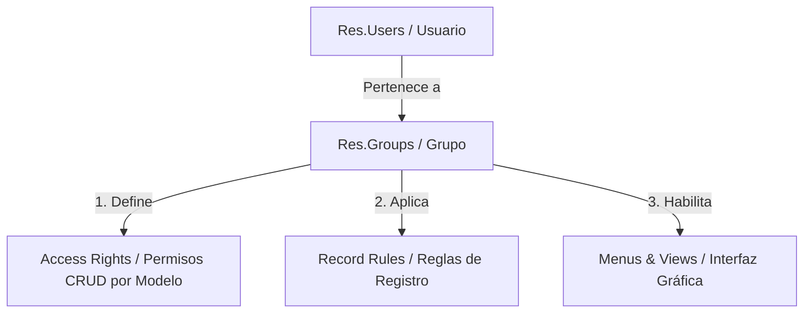

# 🔐 Arquitectura de Roles y Permisos en Odoo

Este documento explica cómo Odoo gestiona la seguridad, los accesos, la visualización de aplicaciones y los permisos a nivel de base de datos. Está adaptado al entorno de **Wayki Trek**.

---

## 🏗️ 1. Estructura de Seguridad en Odoo

Odoo utiliza un modelo híbrido basado en **Grupos** (Roles) que combinan:

1. **Derechos de Acceso (Access Rights):** Permisos a nivel de modelo (objeto) para crear, leer, escribir y borrar.
2. **Reglas de Registro (Record Rules):** Filtros a nivel de fila de base de datos (seguridad por registro).
3. **Visibilidad de Interfaz (Menus & Views):** Qué botones, campos, vistas y menús de aplicaciones puede ver el usuario.



---

## 👥 2. Usuarios del Sistema y Grupos de Wayki Trek

En Wayki Trek, todos los usuarios activos tienen asignado el nivel máximo de permisos. Esto se traduce en acceso total a todas las aplicaciones.

### Usuarios principales y sus XML IDs de seguridad:
* **`network@waykitrek.net`**, **`sales@waykitrek.net`**, **`coordinator@waykitrek.net`** y **`leocusi@waykitrek.net`** pertenecen a:
  * `base.group_system` (Administración / Ajustes): Acceso total al menú de configuración técnica.
  * `sales_team.group_sale_manager` (Responsable de Ventas): Permite gestionar todo el pipeline de CRM y Ventas sin limitaciones.
  * `base.group_partner_manager` (Gerente de Contactos): Acceso completo a la edición y eliminación de contactos.

---

## ⚙️ 3. Componentes de Seguridad en Detalle

### A. Grupos (`res.groups`)
Los grupos representan los **roles** en Odoo. 
* Un usuario (`res.users`) puede pertenecer a múltiples grupos (relación muchos a muchos).
* Los grupos pueden heredar permisos de otros grupos (herencia jerárquica). Por ejemplo, el rol "Administrador de Ventas" hereda automáticamente todos los accesos del rol "Usuario de Ventas".

### B. Derechos de Acceso (`ir.model.access`)
Define los permisos CRUD (Crear, Leer, Escribir, Eliminar) globales para un modelo específico por cada grupo.

* **Ejemplo en base de datos:**
  * Si el grupo "Ventas / Comercial" tiene permiso de lectura (`perm_read = True`) pero no de eliminación (`perm_unlink = False`) en el modelo `crm.lead`, ningún usuario comercial podrá borrar leads, aunque sí verlos.

### C. Reglas de Registro (`ir.rule`)
Permiten filtrar registros específicos dentro de un modelo basándose en un dominio de Python (evaluado con los valores del usuario actual, como `user.id` o `user.company_id`).

* **Ejemplo de Regla de Registro típica:**
  * *Nombre:* "Solo Leads Propios"
  * *Modelo:* `crm.lead`
  * *Dominio:* `['|', ('user_id', '=', user.id), ('user_id', '=', False)]`
  * *Resultado:* El usuario solo ve los leads que tiene asignados o que no tienen propietario asignado.

* **Regla de Multi-Compañía:**
  * Odoo maneja la multi-compañía usando reglas de registro globales: `['|', ('company_id', '=', False), ('company_id', 'in', company_ids)]`.

---

## 🚀 4. Gestión mediante Código en `py-odoo-cli`

Cuando interactúas con Odoo a través de la API (`odoo_cli`), debes tener en cuenta:

1. **Contexto de Seguridad:** El cliente ejecuta las operaciones con los permisos del usuario con el que se autenticó (`uid`). Si usas un usuario limitado, la API lanzará un error de acceso si intentas modificar un modelo prohibido.
2. **Ignorar Reglas (SUDO):** En Odoo (mediante Server Actions), puedes usar `.sudo()` para ejecutar código omitiendo las reglas de registro y derechos de acceso del usuario actual:
   ```python
   # Ejecuta el borrado omitiendo los permisos del usuario que originó el trigger
   self.env['crm.lead'].sudo().browse(ids).unlink()
   ```

---

## 📋 5. Buenas Prácticas para Producción

Si en el futuro deseas restringir la visualización de aplicaciones para ciertos usuarios (por ejemplo, que el rol `sales` no pueda cambiar configuraciones técnicas):

1. **Asignación de Grupos en Interfaz:**
   * Ve a **Ajustes > Administrar usuarios**.
   * Selecciona el usuario y en la sección **Administración**, cambia su rol a "Usuario" en lugar de "Administrador de Ajustes" (`base.group_system`).
2. **Crear Reglas Personalizadas:**
   * Utiliza las **Reglas de Registro** (`ir.rule`) para definir que los comerciales solo visualicen sus propias cotizaciones en lugar de las de toda la empresa.
