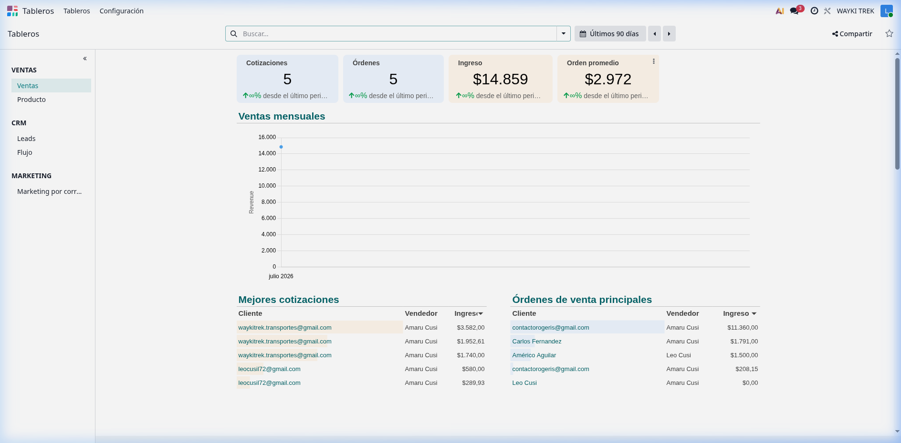
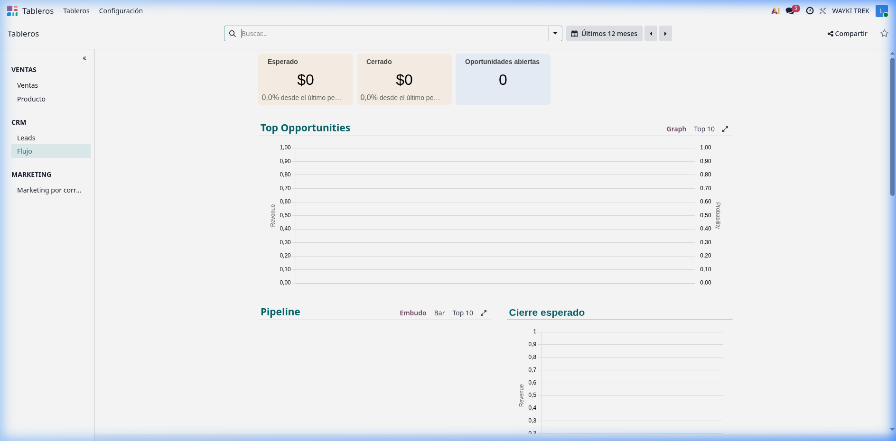

# 📊 Manual de Tableros (Dashboards) en Odoo - Wayki Trek

Este documento detalla la estructura, KPIs y orígenes de datos de los tableros configurados en Odoo para **Wayki Trek**.

---

## 📸 Capturas de Pantalla (Estructura Visual)

### 1. Tablero de Ventas (Sales Dashboard)

### 2. Tablero de CRM (CRM & Pipeline Dashboard)

---

## 🔍 Análisis Detallado de Tableros

### 📊 1. Tablero de Ventas (`Sales`)
Muestra el rendimiento de cotizaciones y facturación consolidada en tiempo real.

* **Origen de datos:** Tabla de base de datos de Odoo `sale.order`.
* **KPIs Clave (Scorecards):**
  * **Cotizaciones (Quotations):** Total de presupuestos generados en estado `draft` (Borrador) o `sent` (Enviado).
  * **Órdenes (Orders):** Total de presupuestos confirmados como orden de venta (`state = 'sale'`).
  * **Ingreso (Revenue):** Suma total de dólares confirmados en órdenes de venta (`amount_total`).
  * **Orden Promedio:** Promedio de facturación por pedido (`Revenue / Orders`).
* **Gráficas y Tablas:**
  * **Ventas Mensuales:** Gráfico lineal histórico de ingresos mensuales (`date_order`).
  * **Mejores Cotizaciones:** Tabla con los clientes que tienen mayor volumen cotizado.
  * **Órdenes de Venta Principales:** Ranking de ventas cerradas agrupado por cliente y comercial.
  * **Fuentes y Medios Principales (UTM):** Desglose de ingresos según la atribución de marketing (`source_id` y `medium_id`).

---

### 📈 2. Tablero de CRM / Pipeline (`Pipeline`)
Rastrea la salud del embudo de ventas y las conversiones de clientes.

* **Origen de datos:** Tabla de base de datos de Odoo `crm.lead`.
* **KPIs Clave (Scorecards):**
  * **Esperado (Expected Revenue):** Suma de los ingresos esperados de todos los leads activos (`expected_revenue` de oportunidades abiertas).
  * **Cerrado (Won Revenue):** Suma de ingresos ganados (`expected_revenue` donde `probability = 100` y `stage_id.is_won = True`).
  * **Oportunidades Abiertas:** Número de leads activos en proceso de negociación.
* **Gráficas y Tablas:**
  * **Pipeline / Embudo:** Gráfico de embudo con las oportunidades distribuidas por etapa (Nuevo, Negociación, Confirmado, etc.).
  * **Cierre Esperado:** Proyección de ingresos según la fecha estimada de cierre (`date_deadline`).
  * **Top Oportunidades:** Lista de los negocios con mayor potencial de ingresos en negociación.

---

### 📦 3. Tablero de Productos (`Product`)
Permite conocer qué tours y servicios adicionales son los más vendidos y rentables.

* **Origen de datos:** Relación entre `sale.order` y `sale.order.line` (Líneas de pedido).
* **KPIs Clave:**
  * **Volumen Vendido:** Cantidad total de servicios y tours reservados.
  * **Tours más populares:** Ranking de caminatas base (Inca Trail, Salkantay, etc.) con mayor demanda.
  * **Ventas Cruzadas:** Proporción de ingresos generados por servicios adicionales o plantillas incluidas frente al tour base.

---

## 🛠️ ¿Cómo probar que los datos se actualicen?

Dado que los tableros consultan directamente PostgreSQL a través del ORM, puedes verificar los flujos haciendo los siguientes cambios en Odoo:

### Probar Ventas e Ingresos en el Tablero:
1. Ve a **Ventas > Cotizaciones** y crea una cotización para un contacto por un monto de, por ejemplo, `$2,000`.
2. Asigna la Fuente **`Formulario Web`** y el Medio **`Website`** en la pestaña de Información Adicional.
3. Haz clic en **Confirmar** para convertirla en Orden de Venta.
4. Ve al módulo **Tableros > Sales** y verás sumado el valor de `$2,000` y la orden bajo la sección de *Fuentes y Medios Principales*.

### Probar Conversión CRM en el Tablero:
1. Ve a **CRM** y crea una Oportunidad en la etapa de *Negociación / Cotización* con un ingreso esperado de `$3,000`.
2. Arrastra la tarjeta a la columna **Convertido en Cliente / Post-Venta** (o haz clic en el botón *Ganado*).
3. Entra a **Tableros > Pipeline** y el indicador de **Cerrado** se incrementará automáticamente en `$3,000`.
