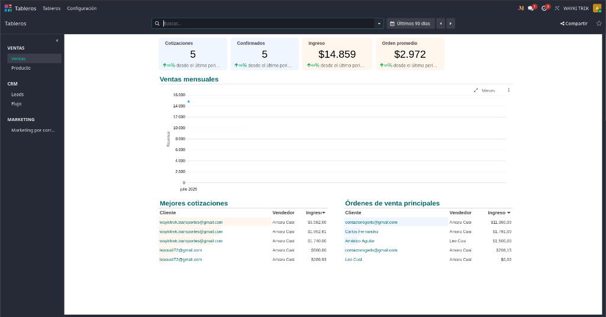
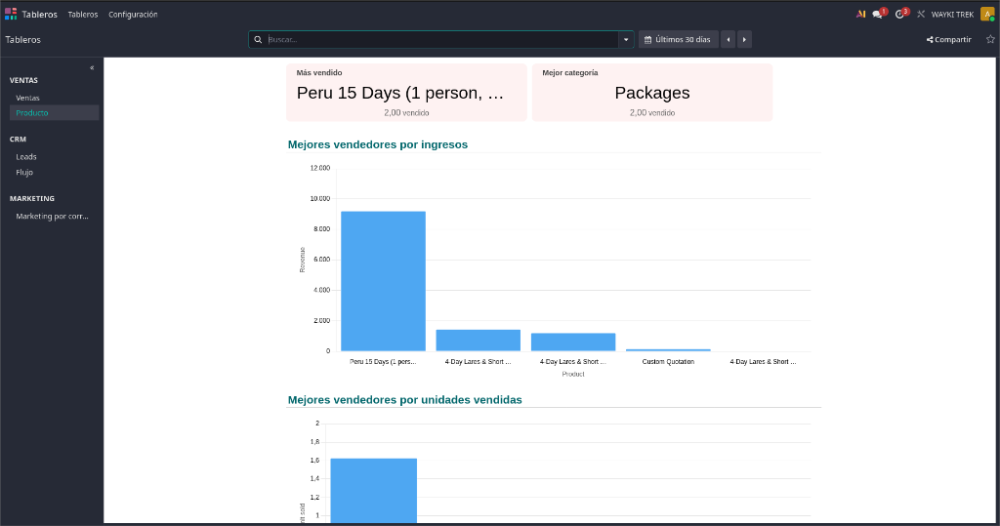
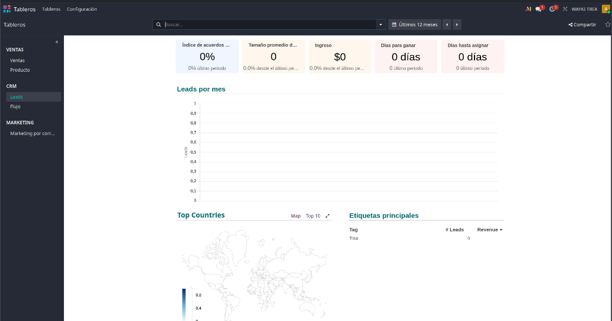
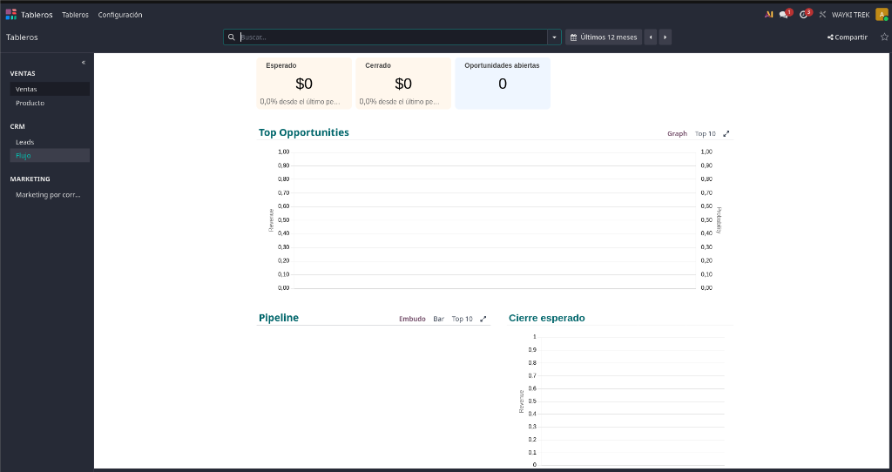
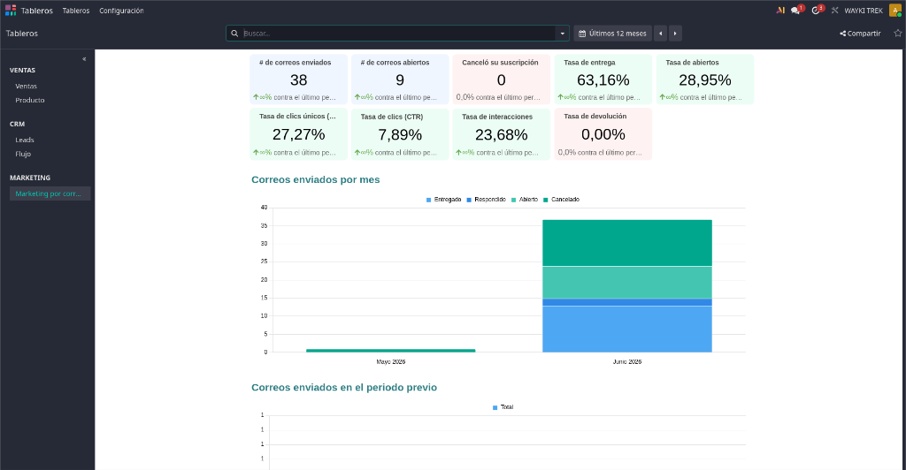

# 📊 Manual de Tableros (Dashboards) - Wayki Trek

Este manual ha sido diseñado para explicar de manera sencilla y clara qué información muestra cada tablero (dashboard) del sistema, de dónde proviene esa información y para qué sirve. Está pensado para que cualquier persona del equipo pueda entender la salud del negocio de un vistazo.

---

## 1. Tablero de Ventas (Sales)
Este tablero es el centro principal para evaluar el desempeño comercial de la empresa. La información se actualiza dinámicamente y puede ser filtrada por distintos periodos de tiempo (por defecto "Últimos 90 días").

**¿De dónde se extrae la información general?**
Toda la data de esta pantalla proviene del módulo de **Ventas** de Odoo. Se alimenta automáticamente de los presupuestos (Cotizaciones) y de las ventas confirmadas (Órdenes de Venta) gestionadas por el equipo comercial.

### Análisis de las métricas y gráficos disponibles:

* **Tarjetas de Indicadores Principales (KPIs superiores):**
  * **Cotizaciones:** Total de presupuestos generados y enviados a los clientes que aún no se han cerrado.
  * **Confirmados:** Número total de ventas que ya han sido aceptadas y oficializadas.
  * **Ingreso:** Monto total de dinero generado por las ventas confirmadas en el periodo seleccionado.
  * **Orden promedio:** El valor monetario promedio de cada venta (Ingresos divididos entre las Órdenes confirmadas). Ayuda a entender el nivel de gasto habitual de los clientes.

* **Gráfico "Ventas mensuales" (Monthly Sales):**
  * Muestra la evolución de los ingresos a lo largo del tiempo. Es fundamental para identificar patrones estacionales (meses de alta o baja demanda en turismo).

### Tablas de Ranking y Desempeño:
Estas secciones organizan la información de mayor a menor para identificar rápidamente las mejores oportunidades comerciales.

* **Top Quotations (Mejores cotizaciones) y Top Sales Orders (Órdenes de venta principales):**
  * Muestran las negociaciones de mayor valor económico. Detallan el Cliente, el Vendedor a cargo y el monto potencial o cerrado (Revenue). 
  * *Fuente:* Cotizaciones pendientes y Órdenes de venta confirmadas, respectivamente.

* **Top Products (Productos más vendidos) y Categorías:**
  * Identifican qué tours específicos y qué familias de productos (ej. "Packages", "Inca Trail") están generando más ingresos y mayor volumen de pedidos.
  * *Fuente:* Las líneas de detalle (los tours específicos agregados) dentro de cada Orden de Venta.

* **Top Countries (Mejores países) y Top Customers (Mejores clientes):**
  * Permiten visualizar geográficamente de dónde provienen los compradores y revelar quiénes son los clientes individuales que más invierten.
  * *Fuente:* La información de perfil y dirección del contacto asociado a la Orden de Venta.

* **Top Sales Teams (Equipos) y Top Salespeople (Vendedores):**
  * Evalúa el rendimiento del personal interno, mostrando qué equipo y qué asesor de ventas está cerrando más tratos y atrayendo mayor cantidad de dinero.
  * *Fuente:* El campo "Vendedor" y "Equipo de Ventas" asignado a cada venta.

* **Top Sources (Orígenes) y Top Mediums (Medios de adquisición):**
  * Analizan por qué canal publicitario o vía de contacto llegó la venta (ej. referidos, sitio web, redes sociales). Es vital para evaluar la efectividad del área de marketing.
  * *Fuente:* Las etiquetas de rastreo (UTM) registradas en Odoo al momento en que el prospecto inició el contacto.

---

## 2. Tablero de Productos (Product)
Este tablero está enfocado enteramente en *qué* es lo que se está vendiendo, en lugar de *cuánto* dinero general ingresa. 

**¿De dónde se extrae la información?**
Se extrae de la combinación del módulo de **Ventas** y el catálogo de **Productos**. Odoo analiza cada línea de las facturas y comprobantes para saber qué tour, paquete o servicio específico compró cada persona.

**¿Qué muestra este tablero?**
* **Más vendido y Mejor categoría (Cuadros superiores):** Te dice de un vistazo cuál es el tour estrella (por ejemplo, "Peru 15 Days") y qué tipo de servicio es el favorito de los clientes de forma general (ej. la categoría "Packages").
* **Mejores vendedores por ingresos (Gráfico de barras superior):** Muestra visualmente qué producto específico le está dejando la mayor cantidad de dinero a la empresa.
* **Mejores vendedores por unidades vendidas (Gráfico de barras inferior):** Muestra qué producto se vende más cantidad de veces (independientemente de si es un tour barato o caro). Esto es útil para saber qué tours atraen a mayor volumen de personas.

---

## 3. Tablero de Leads (Prospectos)
Un "Lead" o prospecto es una persona que ha mostrado interés (por ejemplo, llenó un formulario en la página web o mandó un correo preguntando), pero que todavía no ha comprado nada. Este tablero mide cómo atraemos a esos posibles clientes.

**¿De dónde se extrae la información?**
Proviene del módulo de **CRM** (Gestión de Relaciones con el Cliente). Se alimenta automáticamente cuando entran nuevos contactos al sistema, mucho antes de que se les envíe un precio o cotización.

**¿Qué muestra este tablero?**
* **Métricas rápidas:** Muestra qué porcentaje de estos interesados se convierten en clientes reales ("Índice de acuerdos"), y cuántos días en promedio tarda el equipo en contactarlos y ganar la venta.
* **Leads por mes (Gráfico):** Te ayuda a ver en qué meses llegan más personas interesadas haciendo preguntas.
* **Top Countries (Mapa Mundial):** ¡Muy visual y estratégico! Pinta en el mapa del mundo de qué países provienen las personas que nos contactan. Es vital para saber en qué países invertir dinero para publicidad.

---

## 4. Tablero de Flujo (Pipeline)
El "Pipeline" o embudo de ventas es el proceso paso a paso por el que pasa un cliente potencial: desde que es un contacto nuevo, pasando por la negociación, hasta que finalmente reserva y paga el tour.

**¿De dónde se extrae la información?**
Al igual que los Leads, se extrae del **CRM**, pero aquí se enfoca exclusivamente en las "Oportunidades" (personas que ya están en un proceso de negociación serio con nuestros vendedores).

**¿Qué muestra este tablero?**
* **Métricas rápidas:** 
  * **Esperado:** Es una proyección a futuro del dinero que *podría* ingresar si los vendedores logran cerrar todas las negociaciones que tienen en curso.
  * **Cerrado:** El dinero que ya se ganó definitivamente.
  * **Oportunidades abiertas:** Cuántas negociaciones activas están manejando los vendedores en este preciso momento.
* **Top Opportunities (Gráfico superior):** Muestra cuáles son las negociaciones más grandes (las que traerían más dinero) y qué probabilidad de éxito tienen.
* **Pipeline / Embudo (Gráfico inferior):** Muestra visualmente dónde se están estancando los clientes. Sirve para detectar problemas (por ejemplo, si a mucha gente se le envía la cotización pero nadie responde para comprar).

---

## 5. Tablero de Marketing por Correo (Email Marketing)
Mide el éxito de las campañas de publicidad o boletines informativos que se envían por correo electrónico masivo a los clientes.

**¿De dónde se extrae la información?**
Directamente del módulo de **Marketing por Correo**. El sistema rastrea de forma invisible qué correos llegan a su destino, cuáles rebotan y si el cliente hizo clic en algún enlace dentro del correo.

**¿Qué muestra este tablero?**
* **Métricas rápidas:** 
  * **Enviados / Abiertos:** Cuántos correos mandamos en total y cuántas personas realmente lo abrieron.
  * **Tasa de abiertos / Tasa de clics:** Te dice en porcentaje qué tan atractivo fue el título de tu correo (si el número es alto, mucha gente lo abrió) y qué tan buena fue la oferta interior (si hicieron clic en los enlaces para leer más).
  * **Canceló su suscripción:** Personas que se aburrieron y pidieron no recibir más correos de la empresa.
* **Correos enviados por mes (Gráfico de barras apiladas):** Permite comparar mes a mes el volumen de correos enviados, desglosando en colores cuántos fueron un éxito (entregados y abiertos) y cuántos fallaron (cancelados o rebotados).

