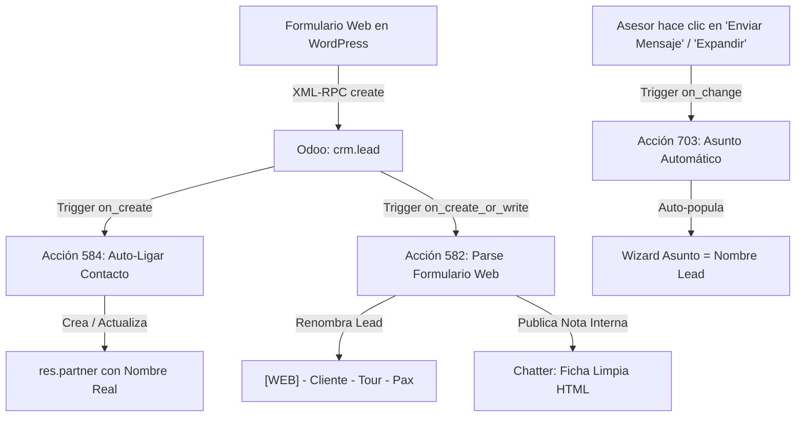

# 📚 Documentación Técnica: Automatizaciones de Formulario Web y CRM (Odoo)

Este documento detalla la arquitectura, componentes, flujo de datos y la **guía paso a paso para realizar futuras mejoras o modificaciones** en las automatizaciones conectadas entre el formulario web de WordPress y el CRM de Odoo.

---

## 🏗️ 1. Mapa de Componentes y Automatizaciones

| ID Regla (`base.automation`) | Nombre de la Automatización | Modelo | Disparador (*Trigger*) | ID Acción de Servidor (`ir.actions.server`) | Propósito Principal |
| :---: | :--- | :--- | :--- | :---: | :--- |
| **`1`** | **`Wayki: Trigger Parse JSON (V2)`** | `crm.lead` | Al crear o modificar (`on_create_or_write`) | **`582`** | Parsea los datos del formulario web, renombra la oportunidad al formato `[WEB] - Cliente - Tour - Pax`, limpia la descripción y publica la nota estructurada en el Chatter. También maneja reservas y pagos directos. |
| **`4`** | **`Trigger: On Lead Creation Link Contact`** | `crm.lead` | Al crear (`on_create`) | **`584`** | Extrae el nombre real del cliente desde el título o campos, crea/actualiza el contacto en la libreta (`res.partner`) y lo vincula a `partner_id`. |
| **`39`** | **`CRM - Auto Asunto en Redactor Email`** | `mail.compose.message` | Al abrir / cambiar campos en UI (`on_change`) | **`703`** | Rellena automáticamente el campo **Asunto** con el nombre exacto de la oportunidad cuando el usuario abre el modal "Redactar correo electrónico". |
| **`2`** | **`CRM: Detección de Duplicados (SaaS)`** | `crm.lead` | Al crear (`on_create`) | **`583`** | Alerta en el Chatter si ya existen otras oportunidades activas con ese mismo correo. |

---

## 🔄 2. Flujo de Datos Detallado



### 1. Entrada desde WordPress:
El formulario web envía por XML-RPC los campos básicos:
* `name`: `Cliente: Nombre Apellido`
* `email_from`: `correo@cliente.com`
* `phone`: `+123456789`
* `description`: Contenedor HTML con el encabezado `DETALLES DEL TOUR (FORMULARIO CUSTOM)` y las líneas de campos.

### 2. Procesamiento y Renombrado (Acción `582`):
1. **Extracción:** Extrae el nombre del cliente, el nombre de la aventura (`Aventura: ...`) y la cantidad de personas (`No. Personas: ...`).
2. **Renombrado del Lead:**
   ```text
   [WEB] - [Nombre Cliente] - [Aventura] - [N° Pax]
   ```
3. **Publicación en Chatter:** Inserta una nota interna limpia (tipo `Notes`, ID de subtipo `2`) con:
   * **Cliente:** Nombre completo
   * **Email:** Correo
   * **Teléfono:** Teléfono
   * **Aventura:** Nombre del tour
   * **No. Personas:** Cantidad
   * **Fecha Tentativa:** Fecha elegida
   * **País ID:** País del viajero
   * **Mensaje:** Texto o consultas del viajero

### 3. Asignación del Contacto (Acción `584`):
* Busca el contacto por correo `email_from`.
* Si existe, lo vincula a `partner_id` y **actualiza su nombre al nombre real** si tenía uno genérico.
* Si no existe, crea un nuevo registro en `res.partner`.

### 4. Asunto Automático en Redactor (Acción `703`):
* Al abrir el modal `mail.compose.message` desde la oportunidad, detecta el registro activo de `crm.lead` y asigna `subject = lead.name`.

---

## 🛠️ 3. Guía para Mejorar o Modificar estas Automatizaciones

Si en el futuro deseas agregar nuevos campos al formulario, cambiar el formato del título o ajustar el redactor, sigue estos pasos:

### Caso A: Modificar el Formato del Título de la Oportunidad
El formato se define en la **Acción de Servidor ID `582`**:
1. Conéctate vía CLI / Script o entra a Odoo en modo desarrollador: **Ajustes > Técnico > Acciones de Servidor > ID 582**.
2. Ubica la sección del código:
   ```python
   # ── Formatear Nuevo Nombre de la Oportunidad: [WEB] - Cliente - Tour - Pax ──
   title_parts = ['[WEB]', client_name or 'Cliente']
   if tour_name:
       title_parts.append(tour_name)
   if pax_qty:
       pax_label = f'{pax_qty} Pax' if 'pax' not in pax_qty.lower() else pax_qty
       title_parts.append(pax_label)

   new_opportunity_name = ' - '.join(title_parts)
   ```
3. Modifica la lista `title_parts` con la nueva estructura deseada.

---

### Caso B: Capturar un Nuevo Campo del Formulario (ej. *Idioma* o *Tipo de Hotel*)
1. En tu plugin/formulario de WordPress, envía la nueva línea dentro de la descripción (ej. `Idioma: Ingles`).
2. En la **Acción `582`**, dentro del bucle que recorre las líneas:
   ```python
   for line in lines:
       if line.startswith('Idioma:'):
           idioma_val = line[7:].strip()
           html_lines.append('<strong>Idioma:</strong> ' + idioma_val + '<br>')
   ```
3. Puedes además usar ese valor para mapearlo a un campo nativo o personalizado de Odoo con `record.write({'x_idioma': idioma_val})`.

---

### Caso C: Reglas para la Edición de Código en Acciones de Servidor Odoo (`safe_eval`)
Al programar o modificar código Python dentro de Odoo SaaS:
> [!IMPORTANT]
> 1. **No uses `import re` u otras librerías externas:** El entorno sandbox de Odoo bloquea `re` y disparará un error `NameError: name 're' is not defined`. Usa métodos nativos de strings (`.replace()`, `.split()`, `.find()`, `slice`).
> 2. **No uses atributos dunder protegidos como `__class__` ni `type()`:** Odoo restringe el acceso directo a la jerarquía de tipos.
> 3. **Para publicar notas en el Chatter:** Usa `env['mail.message'].create({...})` con `subtype_id = 2` para asegurar que las etiquetas HTML (`<br>`, `<strong>`) se procesen sin ser escapadas.

---

## 📁 4. Ubicación de Scripts y Backups en el Repositorio

Todos los scripts de actualización y respaldos quedan versionados en la carpeta `scratch/`:
* `scratch/action_582_backup.py`: Código original de la Acción 582.
* `scratch/action_584_backup.py`: Código original de la Acción 584.
* `scratch/deploy_web_title_format.py`: Script ejecutable para volver a desplegar la lógica de títulos `[WEB]` y enlaces de contactos.
